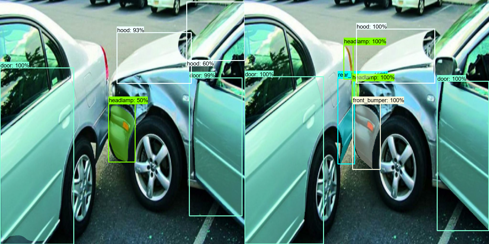
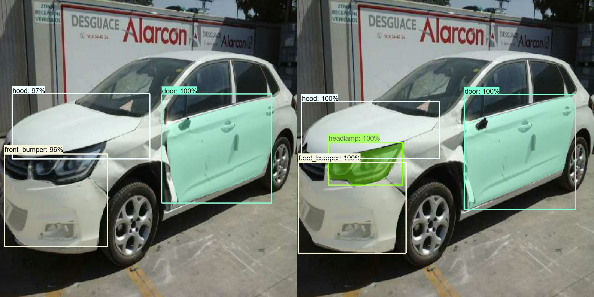
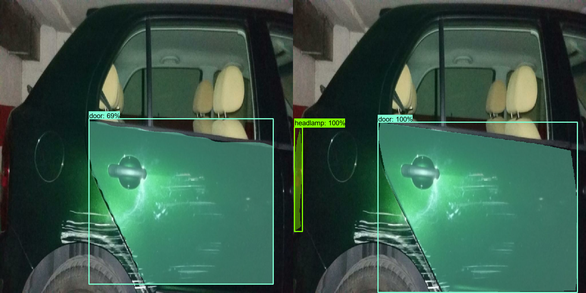
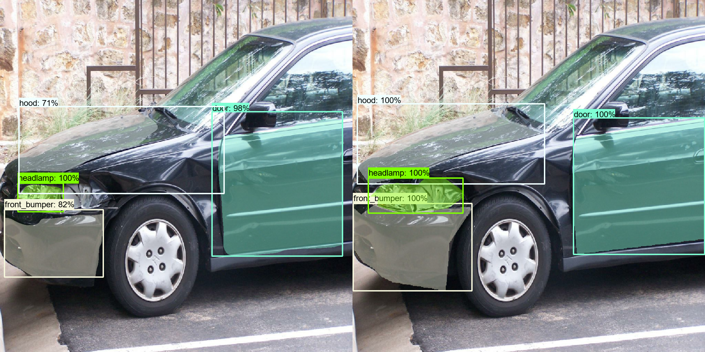
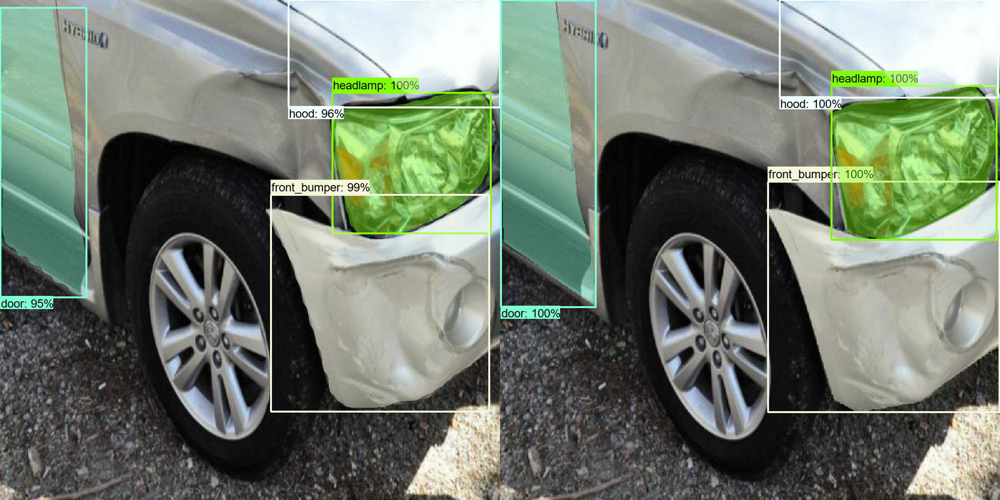

# Car-Crash-Detection-Mask_Rcnn_inception_resnet_v2
This project fine tunes the Mask_Rcnn_inception_resnet_v2 model from object detection model zoo on the Mask detection dataset:https://www.kaggle.com/lplenka/coco-car-damage-detection-dataset

## Dependancies
 - Python 3.x
 - tensoflow 2.x
 - Object detection API 
 
## Test

